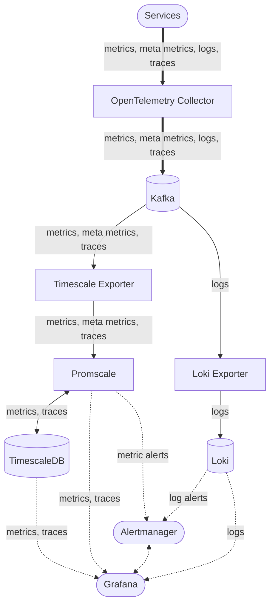

# otel-stack-swarm

```mermaid
flowchart TD
    services([Services])
    otel-collector[OpenTelemetry Collector]
    kafka[(Kafka)]
    timescale-exporter[Timescale Exporter]
    promscale[Promscale]
    timescaledb[(TimescaleDB)]
    alertmanager([Alertmanager])
    loki-exporter[Loki Exporter]
    loki[(Loki)]
    grafana([Grafana])
    services ==>|metrics, meta metrics, logs, traces| otel-collector ==>|metrics, meta metrics, logs, traces| kafka
    promscale <-->|metrics, traces| timescaledb -..->|metrics, traces| grafana
    kafka -->|metrics, meta metrics, traces| timescale-exporter -->|metrics, meta metrics, traces| promscale -.->|metrics, traces| grafana
    loki -.->|log alerts| alertmanager
    promscale -.->|metric alerts| alertmanager
    alertmanager <-.-> grafana
    kafka -->|logs| loki-exporter -->|logs| loki -.->|logs| grafana
```
