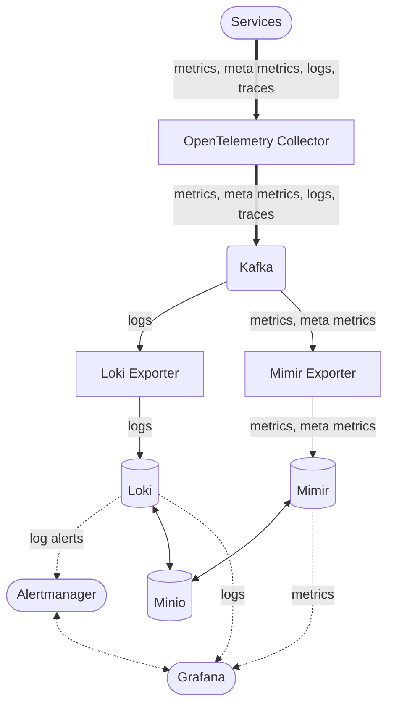

# otel-stack-swarm

```mermaid
flowchart TD
    services([Services])
    otel-collector[OpenTelemetry Collector]
    kafka(Kafka)
    s3[(Minio)]
    alertmanager([Alertmanager])
    loki-exporter[Loki Exporter]
    loki[(Loki)]
    mimir-exporter[Mimir Exporter]
    mimir[(Mimir)]
    grafana([Grafana])
    services ==>|metrics, meta metrics, logs, traces| otel-collector ==>|metrics, meta metrics, logs, traces| kafka
    mimir <--> s3
    loki -.->|log alerts| alertmanager
    loki <--> s3
    alertmanager <-.-> grafana
    kafka -->|logs| loki-exporter -->|logs| loki -.->|logs| grafana
    kafka -->|metrics, meta metrics| mimir-exporter -->|metrics, meta metrics| mimir -.->|metrics| grafana
```
