# otel-stack-swarm

Canonical architecture is **OTel ingest + Kafka buffering**, with swappable sink stacks.
Current default sinks are VictoriaLogs, VictoriaMetrics, and VictoriaTraces.

- Core design goal: keep ingest and transport stable while making log/metric/trace backends interchangeable.
- Metrics backend expectation: Prometheus-compatible query language (PromQL).
- S3/MinIO is not part of the current canonical stack.

## Architecture

```mermaid
flowchart TD
    sources([Sources<br/>OTLP, Docker logs, Syslog, Carbon, Influx, Jaeger]) -->|metrics, meta metrics, logs, traces| ingest[OTel Ingest Collector]
    ingest -->|metrics, meta metrics, logs, traces| kafka[(Kafka)]

    kafka -->|traces| tp[Trace Processor Collector]
    tp -->|metrics| kafka

    kafka -->|logs| vlexp[VictoriaLogs Exporter Collector]
    kafka -->|metrics, meta metrics| vmexp[VictoriaMetrics Exporter Collector]
    kafka -->|traces| vtexp[VictoriaTraces Exporter Collector]

    vlexp -->|logs| vlogs[(VictoriaLogs)]
    vmexp -->|metrics, meta metrics| vmetrics[(VictoriaMetrics)]
    vtexp -->|traces| vtraces[(VictoriaTraces)]

    vlogs -->|logs| grafana[Grafana]
    vmetrics -->|metrics| grafana
    vtraces -->|traces| grafana

    grafana <--> alertmanager[Alertmanager]
    alertmanager -. optional .-> rulerproxy[Grafana Ruler Proxy]
```



## Stack Files

- `otel.yml`: ingest collector, Kafka, kafka-cli (disabled by default), trace-processor.
- `victorialogs.yml`: VictoriaLogs + VictoriaLogs exporter.
- `victoriametrics.yml`: VictoriaMetrics + main/recovery exporters.
- `victoriatraces.yml`: VictoriaTraces + VictoriaTraces exporter.
- `grafana.yml`: Grafana + Postgres.
- `alertmanager.yml`: Alertmanager + optional `grafana-ruler-proxy` (disabled by default).

OTel collector configs are in `configs/otel`.
`todo/` keeps environment snapshots and reference files.

## Deploy

Set `DATA_PATH` to your host data/config root. The stack expects config mounts such as:

- `${DATA_PATH}/otel/*.yaml`
- `${DATA_PATH}/grafana/config`
- `${DATA_PATH}/alertmanager/config`

Deploy as one stack from split manifests:

```bash
docker stack deploy \
    -c otel.yml \
    -c victorialogs.yml \
    -c victoriametrics.yml \
    -c victoriatraces.yml \
    -c grafana.yml \
    -c alertmanager.yml \
    monitoring
```

## Helm (Kubernetes)

A single Helm chart implementation is available at `helm/otel-stack`.

```bash
cd helm/otel-stack
helm dependency update
helm upgrade --install otel-stack . --namespace monitoring --create-namespace
```

## Kafka Topics

Use `kafka-create-topics.sh` to create:

- `otlp_logs`: log records from OTLP, syslog, and fluentforward inputs.
- `otlp_metrics`: regular telemetry metrics from apps/infrastructure, plus derived trace metrics from `trace-processor` (spanmetrics/servicegraph).
- `otlp_meta_metrics`: pipeline-observability metrics about the monitoring stack itself (collector feedback, Kafka broker/topic/consumer stats, and count metrics such as `trace.span.count`, `metric.count`, `log.record.count`).
- `otlp_spans`: trace spans from OTLP/Jaeger ingestion.

### What `meta_metrics` means

- `meta_metrics` are not business/application metrics; they are control-plane metrics for the telemetry pipeline.
- They help answer questions like: “is ingest healthy?”, “are Kafka consumers lagging?”, “are we dropping/under-processing signals?”, and “what volume of spans/logs/metrics is currently flowing?”.
- In this stack, `victoriametrics-exporter` consumes both `otlp_metrics` and `otlp_meta_metrics`, so Grafana can show service metrics and pipeline-health metrics together.
